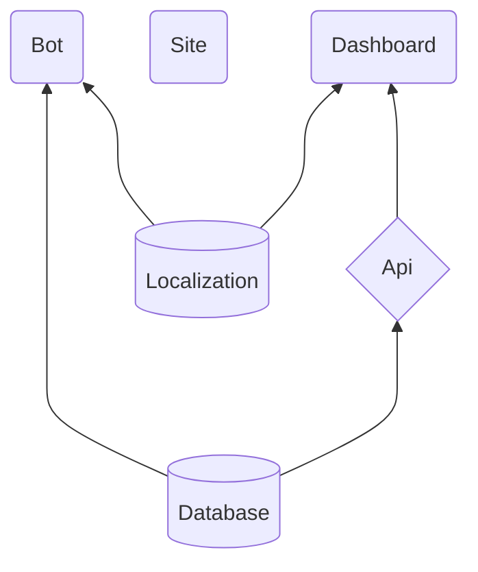

  

<h1 align="center">Changelog Bot</h1>

Discord bot for changelog with dashboard and support for editing, multiple projects, images, logos and themes.

```mermaid
flowchart BT
    database[(Database)]--->bot(Bot)
    database[(Database)]--->api(Api)
    localization[(Localization)]--->bot(Bot)
    localization[(Localization)]~~~~site(Site)
    localization[(Localization)]--->dashboard(Dashboard)
    api{Api}--->dashboard(Dashboard)
```
##

  

